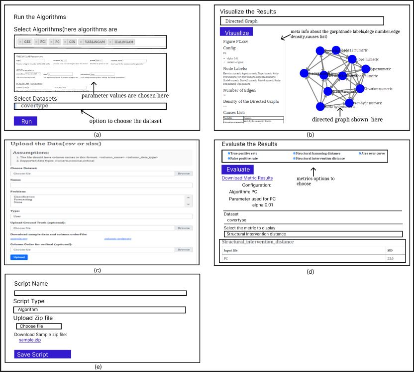

# UPREVE- An End-to-End casual discovery system

UPREVE is a user-friendly web-based graphical user interface (GUI) designed to simplify the process of causal discovery. It provides researchers and practitioners with a comprehensive solution for exploring and understanding causal relationships in complex systems.

## Architecture

The UPREVE system consists of several modules that interact with each other to streamline the process of causal discovery. The integral modules of the UPREVE architecture are as follows:

### Dataset Upload and Preprocess Module

The Dataset Upload and Preprocess Module allows users to upload CSV/XLSX datasets into the UPREVE system. Users provide information about the dataset, such as its name, type, problem type, and ground truth data. The module supports datasets with proper variable identification through column names.

### Algorithm/Metric Upload Module

The Algorithm/Metric Upload Module enables users to upload scripts related to causal algorithms and metric evaluation into the UPREVE system. Users can upload pre-existing algorithms or create their own by uploading a zip file containing the necessary files. The module supports Python and R scripts for algorithm execution.

### Algorithm Execution Module

The Algorithm Execution Module executes causal discovery algorithms on the uploaded dataset. Users have the flexibility to select the algorithms they wish to execute and adjust their configurations accordingly. The module generates results that can be downloaded, visualized, or evaluated using appropriate metrics if a ground truth is available.

### Visualization Module

The Visualization Module enables users to observe and interact with the outcomes of the executed algorithms. Users have various graphical options to choose from, including directed graphs and heat maps. The module provides metadata associated with each visualization, such as node names, the number of edges, and the graph's density. Users can download the visualization data for further analysis.

### Metrics Evaluation Module

The Metrics Evaluation Module allows users to compare the performance of different algorithms for determining causal relationships. The module supports both pre-existing and custom metrics. It presents the evaluation findings in a tabular format, allowing users to select the desired metric and view the corresponding results.

By integrating these modules, the UPREVE system provides a comprehensive approach to causal discovery. It automates algorithm selection, provides visualization capabilities for exploring causal relationships, and offers metric evaluation to compare algorithm performance. This architecture empowers researchers and practitioners from various fields to efficiently analyze complex datasets and gain valuable insights for decision-making.



## Installation and Usage

To run UPREVE locally, follow these steps:

1. Clone the repository:

2. Navigate to the project directory:


3. Create a virtual environment:
   '''
   python3 -m venv env
   '''
4. Activate the virtual environment:
- For Windows:
  ```
  env\Scripts\activate
  ```
- For macOS and Linux:
  ```
  source env/bin/activate
  ```

5. Install the required packages:
   pip install -r requirement.txt

6. Run the application using Gunicorn:
   gunicorn --bind server_ip:port_no wsgi:app

